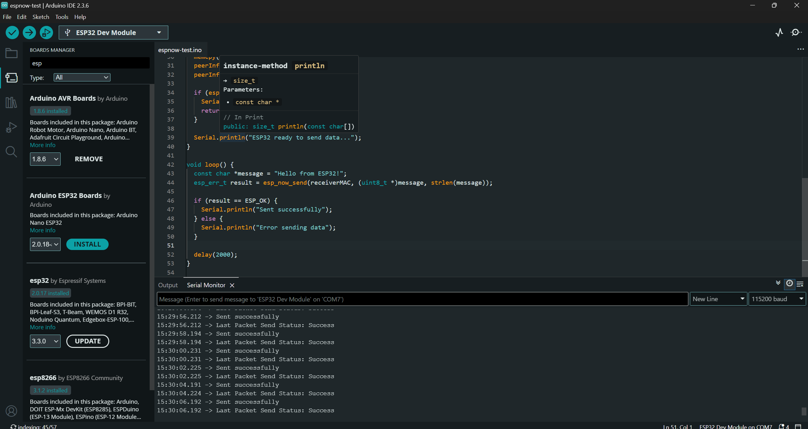
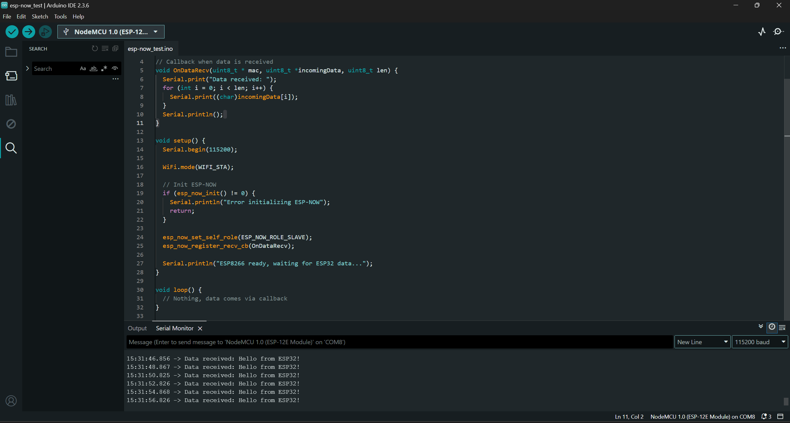
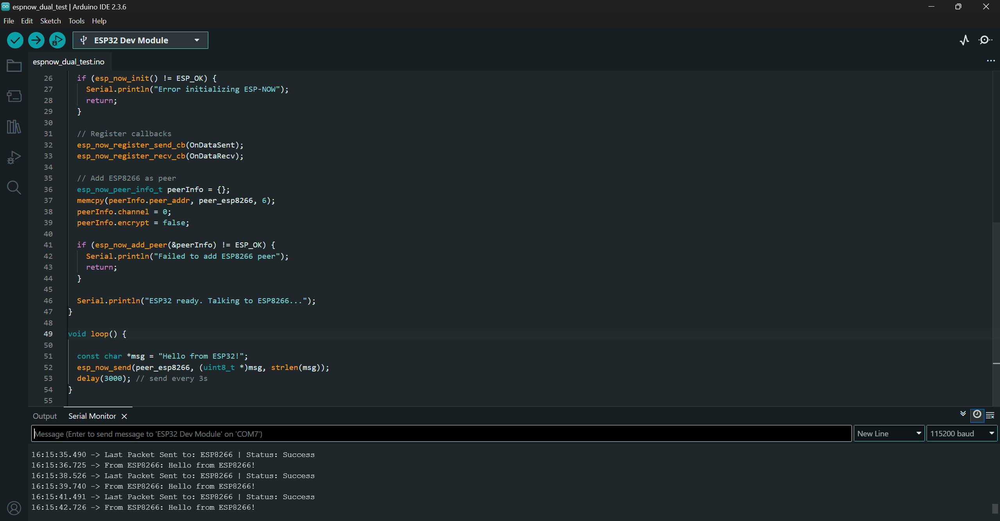
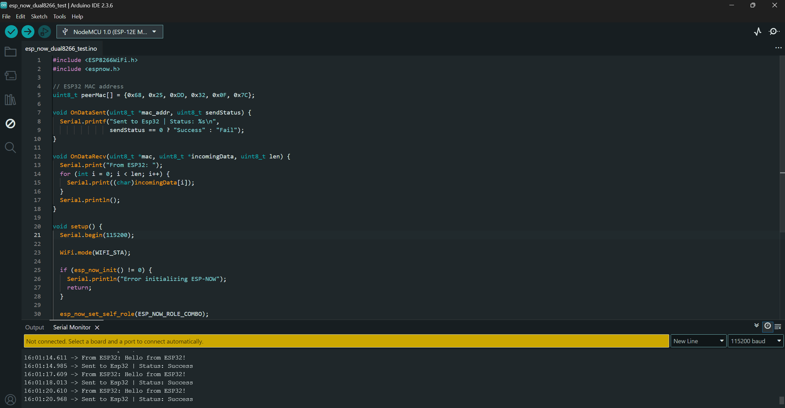

# 📡 ESP-NOW Communication (ESP32 & ESP8266)

This repository contains two working implementations of **ESP-NOW communication** between ESP32 and ESP8266 boards:  
1. **Single Channel Communication** – One-way data transfer.  
2. **Dual Channel Communication** – Bi-directional data transfer.

---

## 🚀 Technologies Used
<div align="center">


</div>

---

## ⚙️ Requirements

- **Arduino IDE** with ESP32 & ESP8266 board packages installed.  
- **ESP32 Board Version**: `2.0.17` (⚠️ Use this version for compatibility).  
- One ESP32 and one ESP8266 development board.  

---

## 📌 Setup Instructions

1. **Get the MAC addresses of both boards**  
   - Upload the provided `get-mac.ino` sketch to each board.  
   - Open **Serial Monitor** → Note down each board’s MAC address.  
   - ⚠️ Convert MAC addresses to **hexadecimal format** before pasting into the code.

2. **Configure the sender & receiver code**  
   - Replace the placeholder MAC addresses in the code (`peerAddress[]`) with your board MACs.  
   - For **dual channel**, you must enter **both board MACs** in each sketch.

3. **Upload sketches**  
   - Upload the respective sketch to ESP32 and ESP8266.  
   - Open **Serial Monitor** at `115200 baud` to see communication in action.

---

## 📂 Repository Structure

```
esp-now-esp32-esp8266-communication/
│── README.md
│── mac.ino
│── esp32-send.png
│── esp32-dual.png
│── esp8266-recive.png
│── esp8266-dual.png
│
├── single/
│   ├── esp32-sender.ino
│   └── esp8266-receiver.ino
│
└── dual/
    ├── esp32-sender.ino
    └── esp8266-receiver.ino
```


---

## 📸 Screenshots / Demo

### Single

# <div></div>
# <div></div>

### Dual

# <div></div>
# <div></div>

---

## 🧩 Features

- Simple **one-way communication** (ESP32 → ESP8266).  
- **Bi-directional mode** where both boards exchange messages.  
- Lightweight and efficient, runs directly without Wi-Fi router.  

---

## 🔮 Future Improvements

- Add support for multiple peers.  
- Use structured data (JSON) instead of plain strings.  
- Integrate sensors to transmit real-world data.

---

## 📜 License
This project is licensed under the **MIT License** – feel free to use and modify.

---


